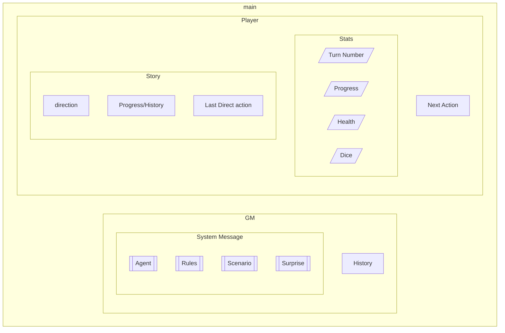

# TODO

- [ ] Facilitator mode

  - [ ] Game Master Area
    - [ ] System message area.
      - [ ] Contains the identity of ChatGPT Agent and game rules
      - [ ] History function
      - [ ] Multiple sections can be activated and deactivated with check boxes to easily experiment with different system message combos
    - [ ] Surprise!
      - [ ] Inject an unexpected event into ongoing player chats
  - [ ] Player Area (below) maybe in a different tabs?

- [ ] Player Mode
  - [ ] Show only the player area
  - [ ] could maybe have a stats section, instead of outputting stats in the story area
    - [ ] Turn Number
    - [ ] Progress Tracking
    - [ ] Health/some other stat
  - [ ] Story Area
    - [ ] Shows the whole story thus far.
    - [ ] What was added on the last turn is delineated somehow. Perhaps text color.
  - [ ] Next move input area
    - [ ] Text box + submit button
  - [ ] Ability to generate random numbers for 'dice rolls'?

- Use Story area for consecutive prompts
